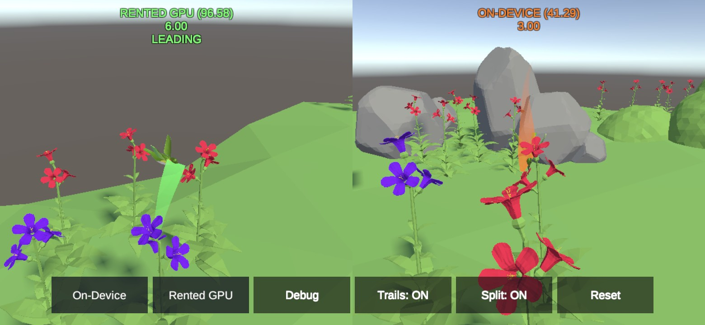
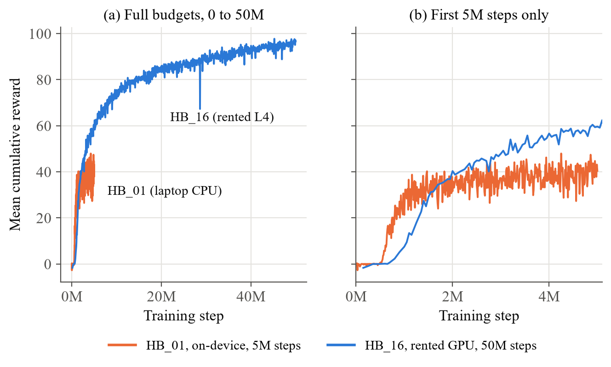
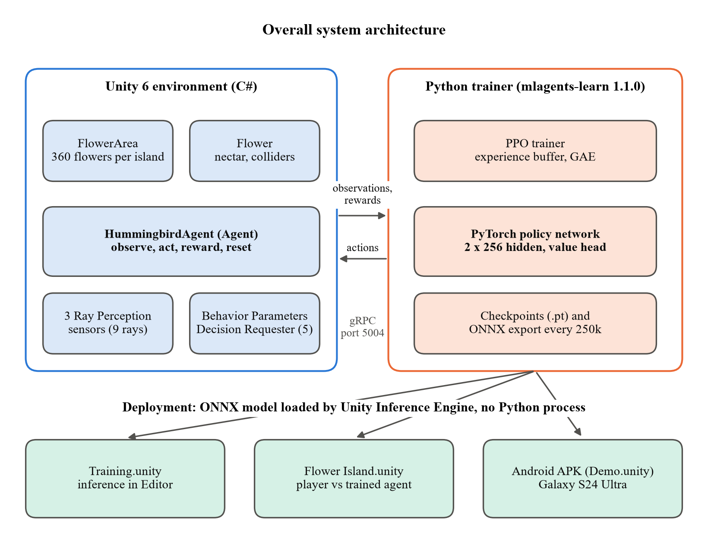

# Hummingbird ML-Agents

A reinforcement learning agent, trained with PPO in Unity ML-Agents, that learns to fly around a floating
island and feed on flower nectar with no scripted behaviour. It was trained twice: once on a laptop CPU and
once on a rented NVIDIA L4 cloud instance with 112 arenas in parallel. The final model runs entirely inside
Unity, in the Editor, on an Android phone or in a web browser, with no Python connection.

**Try it in your browser: [rohith602.github.io/HummingbirdMLAgents](https://rohith602.github.io/HummingbirdMLAgents/)**
(tested in desktop Chrome, about 27 MB to load, nothing to install). Press START, then use the buttons to
switch between the two trained models, show what the agent senses (Debug), or race both models side by side
(Split). Drag with the mouse to orbit the camera.

MCA (Generative AI) mini project, Department of Computer Applications, SRM Institute of Science and Technology.



## Results

| Run | Where | Steps | Arenas | Stacked vectors | Mean reward |
|---|---|---|---|---|---|
| HB_01 | Laptop CPU, about 31 hours | 5,000,024 | 1 | 1 | **41.29** |
| HB_16 | Rented NVIDIA L4, about 5 hours | 50,000,000 | 112 | 3 | **96.58** (best 97.73) |

HB_01 had not plateaued when it stopped; it ran out of steps while its learning rate decayed to zero. It also
saw only one frame of observations, so it had no way to sense its own velocity. HB_16 fixed both: three
stacked frames and ten times the step budget, which gave a 2.35x higher mean reward.



Videos of the agent (download to play): [HB_01 laptop run](docs/videos/slide10_on_device.mp4),
[HB_16 rented-GPU run](docs/videos/slide10_rented_gpu.mp4), and training progress at
[0.5M steps](docs/videos/slide11_early_0.5M.mp4), [2.5M steps](docs/videos/slide11_mid_2.5M.mp4) and
[50M steps](docs/videos/slide11_final_HB16_50M.mp4).

## How the agent works

- **Observations:** 10 numbers per step (its rotation, the direction to the nearest flower, beak alignment,
  distance) plus three ray sensors facing forward, up and down that detect the island boundary. No camera.
  HB_16 stacks the last 3 frames of the 10 numbers.
- **Actions:** 5 continuous values: movement on x, y and z, plus pitch and yaw.
- **Reward:** +0.01 for every step spent drinking nectar (with a small bonus for facing the flower head on),
  and -0.5 for hitting the island boundary.
- **Training:** PPO, a 2 x 256 network, episodes of 5,000 steps.



## Repository layout

```
Assets/Hummingbird/        scripts, scenes, prefabs, trained models (NN Models/), art from the course
Packages/, ProjectSettings/  Unity project setup
Training/                  trainer configs, rented-server scripts, run logs of HB_01 and HB_16
docs/                      report (PDF and Word), presentation, videos, figures
```

Scenes in `Assets/Hummingbird/Scenes`:
- `Training.unity`: the training arena (used by `mlagents-learn` and the Linux server build)
- `Flower Island.unity`: the minigame, where you race the trained bird
- `Demo.unity`: the phone and browser demo with buttons to switch models, show the agent's rays, draw flight trails and
  race both models side by side

## Running it

1. Install Unity **6000.4.7f1** and open this folder as a project. The ML-Agents package (4.1.0) is fetched
   automatically.
2. Open `Demo.unity` or `Flower Island.unity` and press Play. The trained models are already assigned.

To train again you need Python with `mlagents` 1.1.0:

```
mlagents-learn Training/config/trainer_config_16.yaml --run-id=MyRun
```

then press Play in `Training.unity`. `Training/RENTAL_STEPS.md`, `setup_server.sh` and `train_16.sh` describe
the rented-server run: a headless Linux build, many arenas per process, and a resumable run. The main
lessons from that run: the workload is CPU-bound (the policy update, the only part a GPU can speed up, is about
3.5% of the training time), the Linux
player needs a 24-bit virtual display plus `-batchmode` (13x faster than without it), and splitting arenas
across several processes matters more than the total arena count.

## Documents

- [Project report (PDF)](docs/Hummingbird_MLAgents_Report.pdf), also as [Word](docs/Hummingbird_MLAgents_Report.docx)
- [Presentation (PowerPoint, with the videos embedded)](docs/Hummingbird_ML-Agents.pptx)

## Credits

- Based on the Unity Learn course **ML-Agents: Hummingbirds** by Adam Kelly (Immersive Limit). The bird,
  flower and island art and the original tutorial scripts come from that course; the scripts here were
  ported to Unity 6 and ML-Agents 4 and extended (multi-island training, observation stacking, the phone demo).
- Ambient bird sound: "Ambient Bird Sounds" from OpenGameArt (CC0).
- Unity ML-Agents Toolkit by Unity Technologies.
